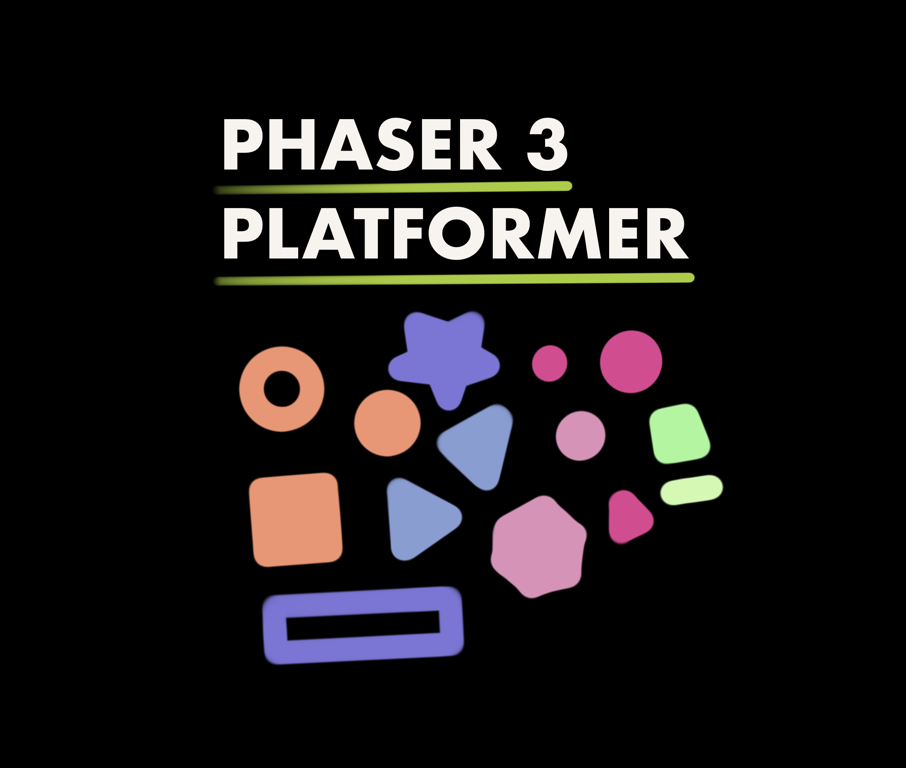

# phaser3-platformer



A phaser platformer template.

This project was originally forked from [phaser-snowpack](https://github.com/hyanmandian/phaser-snowpack) by [hyanmandian](https://github.com/hyanmandian).

I made my own version to add ESLint and AVA modules. If you want a version without these addons, you should check the [original project](https://github.com/hyanmandian/phaser-snowpack).

## Technologies

This platformer template contains:

* [TypeScript](https://www.typescriptlang.org/) (as a primary language)
* [Snowpack](https://www.snowpack.dev/) (as a toolchain)
* [ESLint](https://eslint.org/) (for code linting)
* [AVA](https://github.com/avajs/ava) (for unit tests)

## Quickstart

* Clone locally

  ```Bash
  > git clone https://github.com/rootasjey/phaser3-platformer.git
  ```

* Navigate the created directory

  ```Bash
  > cd phaser3-platformer
  ```

* Install dependencies

  ```Bash
  > yarn # or npm install
  ```

* Run

  ```Bash
  > yarn run start # or npm start
  ```

## Snowpack

Snowpack is a fast web toolchain running your dev server in 50ms! 🚀

The 1st run will be slower because it will fetches and installs phaser.

## Code Linting

You can lint your code the lint command:

```Bash
> yarn run lint # or npm run lint
```

Alternatively, you can install an IDE extension to automatically lint your code on edit. I use [ESLint](https://marketplace.visualstudio.com/items?itemName=dbaeumer.vscode-eslint) for VSCode.

To chande lint rules, edit `./.eslintrc` file.

You can find the available rules here:

* [JavaScript](https://eslint.org/docs/rules/)
* [TypeScript](https://github.com/typescript-eslint/typescript-eslint/tree/master/packages/eslint-plugin)

## Unit tests

Tests are localted in the `./tests/` folder.

You can run your unit tests with the following commands:

```Bash
yarn run test # or npm run test
```

You can also active the watch mode:

```Bash
yarn run test:watch # or npm run test:watch
```

## Organize your game

* `assets`: add your assets (`.png`, `.json`, `.mp3`, ...) in the [./assets/](./assets/) folder
* `source`: add your source code (`.ts`, `.test.ts`) in the [./src/](./src/) folder
* `scenes`: a scene often represents a level in a game. You can them in the [./src/scenes/](./src/scenes/) folder
* `sprites`: a sprite represents a player, an enemy or a NPC (non-player character). You can them in the [./src/sprites/](./src/sprites) folder

## Dependencies

Because I don't like to use bloated template, I'll explain what's inside this one.

* Main
  * __Phaser__\
    Phaser is the only main dependency.

    ```JSON
    "phaser": "3.x"
    ```

* Dev\
  Other dependencies for devlopers.
  * __AVA__ (unit tests)\
    AVA is a minimal and fast tests runner.

    ```JSON
    "ava": "3.x",
    "ts-node": "8.x",
    ```

    `ts-node` is necessary to write unit test with TypeScript as well as the following rule

    ```JSON
      "ava": {
        "extensions": [
          "ts"
        ],
        "require": [
          "ts-node/register/transpile-only"
        ]
      }
    ```

    ---
  * __ESLint__ (code linting)\
    As [TSLint](https://github.com/palantir/tslint) is now deprecated, ESLint is now one of its replacement.

    ```JSON
      "@typescript-eslint/eslint-plugin": "3.x",
      "@typescript-eslint/parser": "3.x",
      "eslint": "7.x",
      "eslint-config-standard-with-typescript": "18.x",
      "eslint-plugin-import": "2.x",
      "eslint-plugin-node": "11.x",
      "eslint-plugin-promise": "4.x",
      "eslint-plugin-standard": "4.x",
    ```

    This repo use a modified version of the [standard plugin](https://github.com/standard/eslint-config-standard-with-typescript).

    ---
  * __Snowpack__ (web toolchain)\
    Snowpack is a fast web toolchain getting your dev server up in 50ms or less.

    ```JSON
    "snowpack": "2.x"
    ```

    ---
  * __TypeScript__ (types definitions)\
    TypeScript leverages type definitions to write code safely and predictable behavior.

    ```JSON
    "typescript": "3.x"
    ```

## License

This project is under the [MIT License](./LICENSE).
